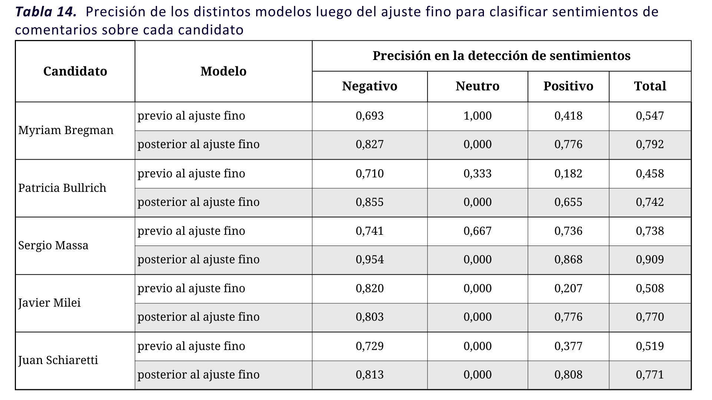

# 🔧 Ajuste Fino

El ajuste fino permite adaptar los modelos base a tareas específicas en un dominio de datos en particular. Al complementar estos modelos heredados con texto etiquetado manualmente, se posibilita el aprendizaje y adaptación del modelo a características propias del lenguaje encontradas en el corpus a clasficar.

Se utiliza el conjunto de datos de entrenamiento (_training dataset_) y el conjunto de datos de prueba (_testing dataset_). En primer lugar, se entrena al modelo base elegido en la sección anterior, el **Modelo 1**, con los datos del conjunto de entranamiento. Una vez entrenado dicho modelo se utiliza este nuevo modelo para clasificar los comentarios del conjunto de datos de prueba para luego evaluar la presición de este nuevo modelo.

### <mark style="background-color:blue;">Librerías utilizadas</mark>

* _<mark style="color:blue;">**pandas:**</mark>_ esta librería fue diseñada para facilitar el análisis y manipulación de datos en forma tabular. Permite cargar datos de diversas fuentes (ej: CSV, Excel, SQL), limpiarlos, filtrar y seleccionar datos, realizar operaciones estadísticas y generar visualizaciones sencillas. Se destaca esta librería por su capacidad de trabajar con grandes volúmenes de datos y su integración con otras librerías de análisis y visualización de datos.
* _<mark style="color:blue;">**scklearn.model\_selection:**</mark>_ es parte de una biblioteca muy popular en python Scikit-learn de aprendizaje automático. Esta librería en particular proporciona funciones y clases para realizar operaciones realcionadas con la selección de modelos
* _<mark style="color:blue;">**transformers:**</mark>_ esta biblioteca pertenece a Hugging Face y es principalmente utilizada para trabajar con modelos de lenguaje pre-entrenados y tareas de NLP.  Dentro de esta biblioteca utilizaremos las clases : XLMRobertaForSequenceClassification, XLMRobertaTokenizer, AutoTokenizer,AutoModelForSequenceClassification, TrainingArguments y Trainer. Las mismas permiten utilizar los modelos importados, tokenizar acorde lo requieran los modelos elegidos y posibilitar el entrenamiento a partir de dichos modelos.
* _<mark style="color:blue;">**torch:**</mark>_ esta libería hace referencia a Pytorch, una biblioteca de aprendizaje profundo desarrollada principalmente por Meta AI y actualmente pertenece a Linux Foundation. Es reconocida por contener una de las principales librerías utilizadas para tareas de Machine Learning: TensorFlow. Esta librería permite realizar operaciones con tensores (arreglos multidimensionales parecidos a matrices), crear modelos, grafos computacionales, proporcionar herramientas y APIs para el despliegue de modelos en entornos de producción, entre otras tareas.
* torch.utils.data: permite personalizar y gestionar conjunto de datos que serán utilizados durante el entrenamiento, validación y evaluación de modelos. La clase 'Dataset' proporciona una abstracción de datos que permite acceder a los elementos individuales de un conjunto de datos de manera eficiente.

```python
import pandas as pd
from sklearn.model_selection import train_test_split
from transformers import XLMRobertaForSequenceClassification, XLMRobertaTokenizer,AutoTokenizer,AutoModelForSequenceClassification,TrainingArguments,Trainer
import torch
from torch.utils.data import Dataset 
```


En esta etapa el código es el mismo para cada candidato, como ejemplo tomaremos el código para entrenar el modelo del candidato Sergio Massa.&#x20;



### <mark style="color:blue;">Creación de la clase "MyDataset"</mark>

La clase 'Mydataset' que hereda de Dataset una clase de Pytorch para trabajar con datos personalizados. Necesitamos convertir los datos etiquetados para la entrada del modelo para su entrenamiento.

```python
# Define el dataset con los datos etiquetados
class MyDataset(Dataset):
    def __init__(self, dataframe, tokenizer, max_length=512, num_labels=3):
        """
        Inicializa el dataset con los datos etiquetados.

        Argumentos:
            dataframe (DataFrame): DataFrame que contiene los datos etiquetados.
            tokenizer (Tokenizer): para convertir texto a tokens.
            max_length (int): Longitud máxima de secuencia permitida por el tokenizer (máximo de tokens)
            num_labels (int): Número de etiquetas en el conjunto de datos. (en este caso tenemos 3 etiquetas:negativo-neutro-positivo)
        """
        self.tokenizer = tokenizer
        self.data = [] #dataset vacío
        for idx, row in dataframe.iterrows():
            text = str(row['Texto_corregido'])
            label = int(row['tag_hf1'])  # Convertir la etiqueta a entero
            # Codificar el texto utilizando el tokenizador
            encoding = tokenizer(text, truncation=True, padding='max_length', max_length=max_length) #padding(relleno) se realiza para homogenizar longitudes y simplificar el procesamiento y la eficiencia computacional
            # Convertir la etiqueta a one-hot encoding: es una forma de respresentar las categorías como vectores binarios. 
            one_hot_label = torch.zeros(num_labels)
            one_hot_label[label] = 1
            # Agregar los datos codificados al dataset
            self.data.append({'input_ids': encoding['input_ids'], #input_ids se refiere a los IDs de los tokens en la secuencia de texto (estos IDs son los que entiende el modelo)
                              'attention_mask': encoding['attention_mask'], #es una máscara que indica qué partes de la secuencia son importantes para el modelo y cuáles corresponden al padding
                              'labels': one_hot_label}) #representa las etiquetas de clasificación codificadas en el formato one-hot
            
    def __len__(self):
        return len(self.data)
    
    def __getitem__(self, idx):
        return {key: val for key, val in self.data[idx].items()}
```

### <mark style="color:blue;">Carga de datos</mark>



```python
file_path1 = 'Massa_30.xlsx'
df1 = pd.read_excel(file_path1)
df_filtrado1= df1.dropna(subset=['tag_hf1'])
columnas_seleccionadas = ['Fuente', 'Texto_corregido', 'tag_hf1']
df11= df_filtrado1[columnas_seleccionadas]
```

<pre class="language-python"><code class="lang-python"># Dividir el DataFrame en conjunto de entrenamiento y pruebas
df1_training, df1_testing = train_test_split(df11, test_size=0.2, random_state=42)

<strong># Imprimir la forma de los nuevos DataFrames
</strong>print("Shape de df1_training:", df1_training.shape)
print("Shape de df1_testing:", df1_testing.shape)
</code></pre>

```python
# Cargar el modelo base y su tokenizador
model_path = "cardiffnlp/twitter-xlm-roberta-base-sentiment"
model = XLMRobertaForSequenceClassification.from_pretrained(model_path)
tokenizer = XLMRobertaTokenizer.from_pretrained(model_path)
```

```python
# Crear instancia del dataset para entrenamiento
train_dataset = MyDataset(df1_training, tokenizer)
```

```python
# Entrenar un modelo nuevo para Myriam Bregman
training_args = TrainingArguments(
    output_dir='./results',  # directorio de salida
    num_train_epochs=3,  # número de epochs
    per_device_train_batch_size=8,  # tamaño de lote por dispositivo de entrenamiento
    logging_dir='./logs',  # directorio de logs
)

```

```python
# Definir el entrenamiento
trainer = Trainer(
    model=model,  # modelo base
    args=training_args,  # argumentos de entrenamiento
    train_dataset=train_dataset,  # dataset de entrenamiento
)
```

```python
# Entrenar el modelo
trainer.train()
```


Esta sentencia puede tomar mucho tiempo en su ejecución, a diferencia de los códigos anteriores.&#x20;


```python
# Guardar el modelo entrenado
trainer.save_model("modelomassabert")
```


Es recomendable guardar el modelo debido al tiempo de ejecución que toma la sentencia, de esta manera, se puede utilizar el modelo en las próximas sentencias sin requerir del tiempo de ejecución que demanda el código anterior.


```python
# Cargar el modelo entrenado
model_path = "modelomassabert"  # Ruta donde guardaste el modelo "massabert"
model = XLMRobertaForSequenceClassification.from_pretrained(model_path)
```

```python
#Utilizamos el modelo nuevo para clasificar el dataset de prueba
# Crear una lista para almacenar los resultados
sentimientos= []

# Iterar a través de las filas del DataFrame y realizar el análisis de sentimientos
for _, row in df1_testing.iterrows():
    # Tomar el texto de la columna 'Texto_corregido'
    text = str(row['Texto_corregido'])  # Convertir a cadena
    
    # Tokenizar y clasificar el texto
    inputs = tokenizer(text, return_tensors="pt", padding=True, truncation=True, max_length=512)
    outputs = model(**inputs)
    logits = outputs.logits
    predicted_class = torch.argmax(logits, dim=1)
    sentimientos.append(predicted_class.item())

# Agregar la columna "sentimiento" al DataFrame original
df1_testing['sentimiento'] = sentimientos

# Imprimir el DataFrame resultante
print(df1_testing)
```

```python
# Calcular coincidencias y errores
coincidencias = (df1_testing['tag_hf1'] == df1_testing['sentimiento']).sum()
errores = (df1_testing['tag_hf1'] != df1_testing['sentimiento']).sum()

# Crear tabla cruzada
tabla_cruzada = pd.crosstab(df1_testing['tag_hf1'], df1_testing['sentimiento'])

# Mostrar resultados
print("Tabla Cruzada de Coincidencias:")
print(tabla_cruzada)

# Crear DataFrame con los resultados
resultados = pd.DataFrame({'Coincidencias': [coincidencias], 'Errores': [errores]})

# Mostrar los resultados
print("\nResultados:")
print(resultados)
```


### Comparación del modelo previo y posterior al ajuste fino

Al ejecutar los entrenamientos para todos los candidatos, los resultados obtenidos fueron los siguientes:

<figure><figcaption></figcaption></figure>

En todas las ocasiones, el modelo posterior al ajuste fino obtiene una mejor precisión en la clasificación de comentarios, particularmente en la detección de comentarios positivos. En el caso de Javier Milei, ocurre que el modelo posterior al ajuste fino es menos preciso que el modelo previo a su entrenamiento, sin embargo, la precisión global es mayor para el modelo ajustado. Para todos los modelos se observa que la precisión a la hora de detectar comentarios con sentimientos neutros es nula, aunque debe resaltarse que la cantidad de comentarios neutros utilizados para el entrenamiento también era de baja frecuencia.
