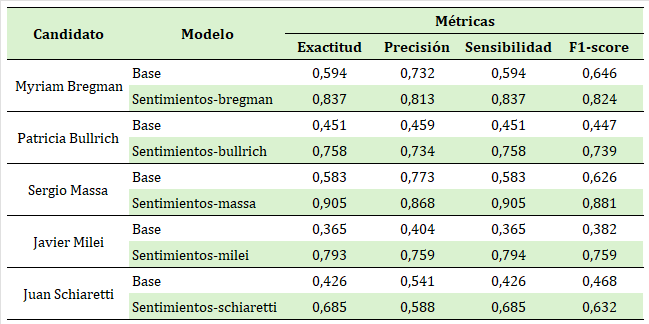

# ⚙️ Ajuste fino

En la sección anterior se evaluó el desempeño del modelo base, en esta sección se realizará un ajuste fino del modelo para adaptarlo mejor a las particularidades del corpus en cuestión, considerando aspectos específicos como los nombres propios, el contexto y el léxico característico de Argentina. Este ajuste busca optimizar el rendimiento del modelo en el análisis de sentimientos dentro del contexto del debate presidencial.

## <mark style="background-color:green;">Librerías</mark>

```python
import pandas as pd
from tqdm import notebook as notebook_tqdm
from sklearn.model_selection import train_test_split
from transformers import (
    XLMRobertaForSequenceClassification,
    XLMRobertaTokenizer,
    AutoTokenizer,
    AutoModelForSequenceClassification,
    TrainingArguments,
    Trainer
)
import torch
import openpyxl
from nltk.tokenize import word_tokenize
from datasets import Dataset
from sklearn.metrics import (
    accuracy_score, 
    precision_recall_fscore_support, 
    confusion_matrix,
    roc_auc_score,
    cohen_kappa_score,
    matthews_corrcoef
)
import psutil
import numpy as np
from tabulate import tabulate

```

## <mark style="background-color:green;">Cargar datos</mark>

Se cargan los datos etiquetados manualmente.




En esta etapa el código es el mismo para cada candidato, como ejemplo tomaremos el código para el caso del candidato Sergio Massa.&#x20;


```python
df = pd.read_excel('massa_etiquetas.xlsx')
df_filtrado = df[df['tag'].notna()]
df_filtrado = df_filtrado[['Fuente', 'Texto_corregido', 'tag']]
```

```python
# Se usa la misma semilla que en la evaluación del modelo base
X_train, X_test, y_train, y_test = train_test_split(X, y, test_size=0.2, random_state=94)
train_df = pd.concat([X_train, y_train], axis=1)
test_df = pd.concat([X_test, y_test], axis=1)
```

## <mark style="background-color:green;">Cargar el modelo base</mark>

Para iniciar el proceso de ajuste fino, primero es necesario cargar el modelo base y su tokenizador. El tokenizador correspondiente asegura que el texto se procese de manera consistente con el modelo, permitiendo que el ajuste fino capture de manera efectiva las particularidades léxicas y contextuales del corpus en estudio.

```python
model_path = "cardiffnlp/twitter-xlm-roberta-base-sentiment"
model = XLMRobertaForSequenceClassification.from_pretrained(model_path)
tokenizer = XLMRobertaTokenizer.from_pretrained(model_path)
```

## <mark style="background-color:green;">Preparar el entrenamiento y cálculo de métricas</mark>

Para preparar el entrenamiento y el cálculo de métricas, se seleccionan las columnas relevantes del conjunto de datos de entrenamiento y prueba. A continuación, se define una función que permite tokenizar el texto y asignar las etiquetas correspondientes en un formato compatible con el modelo. Este proceso asegura que los datos estén correctamente estructurados para el entrenamiento y que el modelo pueda evaluar el rendimiento en función de las métricas seleccionadas.

```python
columnas_seleccionadas = ['Fuente', 'Texto_corregido', 'tag']
test_df= test_df[columnas_seleccionadas]
train_df= train_df[columnas_seleccionadas]
```

```python
def tokenize_and_encode_labels(examples):
    tokenized = tokenizer(examples["Texto_corregido"], padding="max_length", truncation=True, max_length=512)
    tokenized["labels"] = [int(label) for label in examples["tag"]]
    return tokenized
```

Para facilitar el proceso de entrenamiento en Hugging Face, se convierte el dataframe en una clase `Dataset`, que es compatible con los métodos de entrenamiento de la biblioteca. Posteriormente, se aplica la función de tokenización y codificación de etiquetas a cada conjunto de datos, lo que permite preparar de manera eficiente los datos de entrada y sus correspondientes etiquetas. Este paso es fundamental para asegurar que el modelo reciba los datos en el formato esperado y pueda aprender las características específicas del corpus.

```python
# Convierte el dataframe en una clase Dataset de Hugging Face
train_dataset = Dataset.from_pandas(train_df)
test_dataset = Dataset.from_pandas(test_df)

# Aplica la función de tokenización y codificación de etiquetas
train_dataset = train_dataset.map(tokenize_and_encode_labels, batched=True)
test_dataset = test_dataset.map(tokenize_and_encode_labels, batched=True)
```

```python
split_dataset = {
    "train": train_dataset,  # Cambia 'tokenized_train_dataset' por 'train_dataset'
    "test": test_dataset     # Cambia 'tokenized_test_dataset' por 'test_dataset'
}
```

En esta etapa, se configuran los parámetros de entrenamiento mediante la clase `TrainingArguments`. El número de épocas (`num_train_epochs`) indica cuántas veces el modelo verá el conjunto de datos completo durante el entrenamiento, permitiendo un ajuste progresivo de los pesos. El tamaño del batch por dispositivo (`per_device_train_batch_size` y `per_device_eval_batch_size`) define cuántas muestras procesa el modelo a la vez en cada paso de entrenamiento o evaluación, lo cual impacta directamente en la memoria utilizada y en la velocidad de entrenamiento. Además, se establecen estrategias como la de evaluación y guardado, que permite almacenar solo el mejor modelo al final del proceso, optimizando el uso de los recursos y mejorando el rendimiento en función del conjunto de datos específico. Estos ajustes equilibran eficiencia y precisión durante el ajuste fino del modelo.

```python
training_args = TrainingArguments(
    output_dir="./results",
    num_train_epochs=2,
    per_device_train_batch_size=2,
    per_device_eval_batch_size=2,
    gradient_accumulation_steps=8,
    warmup_steps=50,
    weight_decay=0.01,
    logging_dir="./logs",
    logging_steps=10,
    evaluation_strategy="epoch",
    save_strategy="epoch",
    load_best_model_at_end=True,
    save_total_limit=1,  # Mantener solo el mejor modelo
    fp16=False,
)
```

Para evaluar el rendimiento del modelo, se define una función `compute_metrics` que calcula varias métricas comunes en tareas de clasificación, como la exactitud, precisión, la sensibilidad y el F1 score. Estas métricas ayudan a entender la capacidad del modelo para clasificar correctamente las etiquetas en general y en cada clase específica. También se incluye una matriz de confusión que proporciona una visión detallada de los errores de clasificación por clase.

```python
def compute_metrics(pred):
    """
    Calcula métricas de evaluación para el modelo de clasificación.

    Parámetros:
    pred (Predictions): Objeto que contiene las predicciones y las etiquetas 
    verdaderas.

    Retorna:
    Diccionario con las siguientes métricas:
        - accuracy: Exactotid general del modelo.
        - f1: Puntaje F1 ponderado.
        - precision: Precisión promedio ponderada.
        - recall: Sensibilidad promedio ponderado.
        - precision_per_class: Precisión por clase.
        - recall_per_class: sensibilidad por clase.
        - f1_per_class: Puntaje F1 por clase.
        - support_per_class: Número de muestras por clase.
        - confusion_matrix: Matriz de confusión entre etiquetas y predicciones.
    """

    # Extrae las etiquetas verdaderas y las predicciones del objeto `pred`
    labels = pred.label_ids
    preds = pred.predictions.argmax(-1)
    
    # Calcula las métricas generales (promedio ponderado)
    precision, recall, f1, _ = precision_recall_fscore_support(labels, preds, average='weighted')
    acc = accuracy_score(labels, preds)
    
    # Calcula las métricas por clase (sin promedio)
    precision_per_class, recall_per_class, f1_per_class, support_per_class = \
        precision_recall_fscore_support(labels, preds, average=None)
    
    # Calcula la matriz de confusión
    cm = confusion_matrix(labels, preds)
    
    # Retorna las métricas en un diccionario
    return {
        'accuracy': acc,
        'f1': f1,
        'precision': precision,
        'recall': recall,
        'precision_per_class': precision_per_class.tolist(),
        'recall_per_class': recall_per_class.tolist(),
        'f1_per_class': f1_per_class.tolist(),
        'support_per_class': support_per_class.tolist(),
        'confusion_matrix': cm.tolist()
    }
```

## <mark style="background-color:green;">Entrenamiento y evaluación</mark>

Con el modelo y los datos preparados, se configura el proceso de entrenamiento y evaluación mediante la clase `Trainer` de Hugging Face. Esta clase permite automatizar el ajuste del modelo con los datos de entrenamiento y evaluar su rendimiento en el conjunto de prueba, utilizando las métricas definidas previamente.&#x20;

La integración de la función`compute_metrics` facilita el cálculo automático de las métricas detalladas.

```python
trainer = Trainer(
    model=model,
    args=training_args,
    train_dataset=split_dataset["train"],
    eval_dataset=split_dataset["test"],
    compute_metrics=compute_metrics,
)
```

```python
# Entrenar el modelo
trainer.train()
```

```python
# Especifica el directorio donde quieres guardar el modelo
model_dir = "./sentimientos-massa"

# Guarda el modelo y el tokenizador
model.save_pretrained(model_dir)
tokenizer.save_pretrained(model_dir)
```

Una vez completado el proceso de evaluación, se recopilan los resultados para analizar el rendimiento del modelo de manera detallada.

<pre class="language-python"><code class="lang-python"><strong>results = trainer.evaluate()
</strong></code></pre>

A través de la función `visualize_metrics`, se presentan las métricas generales, como precisión, F1 score, precisión y recall, junto con las métricas específicas por clase. Además, se muestra la matriz de confusión, que ayuda a identificar patrones de error específicos entre las clases, proporcionando una visión integral de la efectividad del modelo en el conjunto de prueba.

```python
def visualize_metrics(results):
    # Métricas generales
    general_metrics = [
        ["Accuracy", results['eval_accuracy']],
        ["F1 Score", results['eval_f1']],
        ["Precision", results['eval_precision']],
        ["Recall", results['eval_recall']]
    ]
    
    print("Métricas Generales:")
    print(tabulate(general_metrics, headers=["Métrica", "Valor"], tablefmt="grid"))
    print("\n")

    # Métricas por clase
    class_metrics = []
    for i in range(len(results['eval_precision_per_class'])):
        class_metrics.append([
            f"Clase {i}",
            results['eval_precision_per_class'][i],
            results['eval_recall_per_class'][i],
            results['eval_f1_per_class'][i],
            results['eval_support_per_class'][i]
        ])
    
    print("Métricas por Clase:")
    print(tabulate(class_metrics, headers=["Clase", "Precision", "Recall", "F1", "Support"], tablefmt="grid"))
    print("\n")

    # Matriz de confusión
    cm = np.array(results['eval_confusion_matrix'])
    print("Matriz de Confusión:")
    print(tabulate(cm, headers=range(cm.shape[1]), showindex="always", tablefmt="grid"))
```

```python
visualize_metrics(results)
```

## <mark style="background-color:green;">Modelo base vs modelos ajustados</mark>

A continuación se presentan las métricas de desempeño del modelo base versus los modelos para cada candidato.&#x20;

<figure><figcaption></figcaption></figure>
