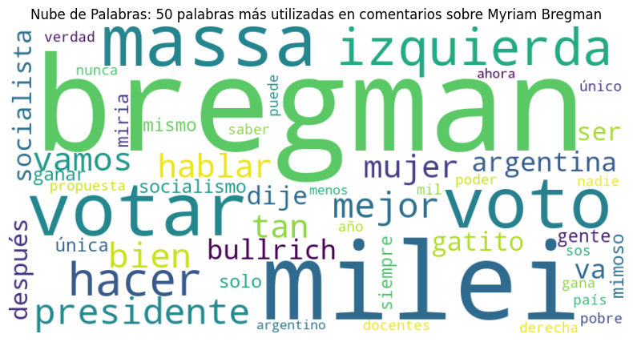
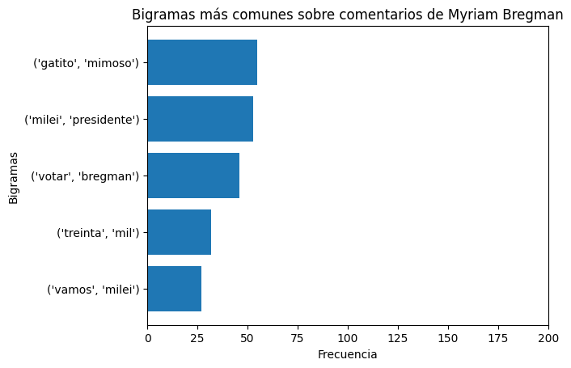

# 🔍 Análisis Exploratorio

El _**análisis de datos exploratorio**_ de los comentarios resulta una etapa fundamental en esta investigación, por un lado, proporciona una comprensión inicial de las palabras utilizadas referidas a cada candidato y por otro lado ha sido utilizado para mejorar y ajustar el paso anterior de limpieza de datos.

## <mark style="background-color:green;">Librerías utilizadas</mark>

````python
import openpyxl # Versión: 3.1.2
import pandas as pd # Versión: 2.2.1
from nltk.corpus import stopwords  # Versión: 3.8.1
import plotly.express as px  # Versión: 5.18.0
from collections import Counter # Versión:  3.11.5
from nltk import FreqDist  # Versión: 3.8.1
from nltk import ngrams # Versión: 3.8.1 
from wordcloud import WordCloud # Versión: 1.9.2
import matplotlib.pyplot as plt #Versión: 3.7.3
import re  # Versión: 2.2.1
import matplotlib.colors as mcolors # Versión:3.7.3 
import networkx as nx # Versión 3.1
import nltk # Versión 3.8.1
from sklearn.feature_extraction.text import CountVectorizer # Versión 1.3.0
from scipy.sparse import csr_matrix # Versión 1.11.2
import numpy as np # Versión 1.25.2
```
````


### Carga de datos

Utilizaremos los datos obtenidos del apartado anterior de limpieza de datos



```python
# Bregman
file_path1 = 'filtrado_bregman.xlsx'
df1 = pd.read_excel(file_path1)
# Bullrich
file_path2 = 'filtrado_bullrich.xlsx'
df2 = pd.read_excel(file_path2)
# Massa
file_path3 = 'filtrado_massa.xlsx'
df3= pd.read_excel(file_path3)
# Milei
file_path4 = 'filtrado_milei.xlsx'
df4 = pd.read_excel(file_path4)
# Schiaretti
file_path5 = 'filtrado_schiaretti.xlsx'
df5 = pd.read_excel(file_path5)
```


Al tratarse del mismo código para cada candidato, se utilizará como ejemplo el primer data frame df1, que corresponde a la candidata Myriam Bregman. Para realizar las visualizaciones de los restantes candidatos deberá reemplazarse df1 por el correspondiente data frame.


## <mark style="color:blue;">Depuración y reemplazos para visualizaciones</mark>

## <mark style="color:blue;">Visualizaciones</mark>

### <mark style="color:blue;">Número de comentarios por red social</mark>

Para observar con cuántos comentarios se cuenta para cada candidato en las distintas redes sociales, construímos gráficos de columnas. Para cada candidato se debe ejecutar el siguiente código:

```python
# Agrupar los datos por 'Fuente' y contar el número de ocurrencias
df_graf1 = df1.groupby('Fuente').count()['Texto_corregido'].reset_index()

# Crear la gráfica de barras
figura = px.bar(df_graf1, x='Fuente', y='Texto_corregido', title="Frecuencia de comentarios por red social sobre Myriam Bregman",
                labels={'Fuente': 'Red Social', 'Texto_corregido': 'Cantidad de comentarios'})

# Cambiar el color de fondo del gráfico a blanco
figura.update_layout(plot_bgcolor='white')

# Ajustar la altura del gráfico
figura.update_layout(height=400)  # Puedes ajustar el valor de altura según tus necesidades

# Ajustar el rango y las etiquetas del eje Y
figura.update_yaxes(range=[0, 1500], title_text='Cantidad de comentarios')

# Mostrar el gráfica
figura.show()
```

<figure><figcaption><p>Ejemplo cantidad de comentarios por red social para la candidata Myriam Bregman</p></figcaption></figure>

### <mark style="color:blue;">Quitar stopwords</mark>

Se eliminan las “stopwords”, que son palabras como artículos, conectores, que aparecen con gran frecuencia en los comentarios analizados pero no apartan a la calidad del análisis.\
También se actualiza el diccionario de stopwords.

```python
stop = set(nltk.corpus.stopwords.words('spanish')) #carga de stopwords en español
stop.update(['.','q','pq','si','mas','xq','x',"vos",'?', '!','ja','debate','jajaja',"jeje","jaja","jajaj","jajajaja","jejeje","jajjajajajaja",'haber','decir',':', ';', '(', ')', '[', ']', '{', '},']) #actualización
```

```python
#Removemos las stopwords de la columna "Texto_corregido"
df1['Texto_corregido']=df1['Texto_corregido'].apply(lambda x: ' '.join([word for word in x.split() if word not in (stop)]))
```

### <mark style="color:blue;">Nube de palabras</mark>

Las nubes de palabras son una representación visual que muestra los términos más frecuentes en un conjunto de datos. Dichas palabras se presentan en tamaño proporcional a su frecuencia de aparición, es decir, las palabras más mencionadas serán aquellas de mayor dimensión.&#x20;

Las nubes de palabras permiten captar de forma rápida los términos más utilizados y relacionados cada candidato.

```python
# Unir todos los textos de los comentarios en una sola cadena
texto_completo1= ' '.join(df1['Texto_corregido'])

# Contar la frecuencia de cada palabra en el texto completo
counter = Counter(texto_completo1.split())

# Obtener las 50 palabras más comunes y almacenarlas en un diccionario
palabras_comunes = dict(counter.most_common(50))

# Crear la nube de palabras a partir de las frecuencias de las palabras
wordcloud = WordCloud(width=800, height=400, background_color='white').generate_from_frequencies(palabras_comunes)

# Mostrar la nube de palabras utilizando matplotlib
plt.figure(figsize=(10, 5))
plt.imshow(wordcloud, interpolation='bilinear')
plt.axis('off')
plt.title('Nube de Palabras: 50 palabras más utilizadas en comentarios sobre Myriam Bregman')
plt.show()
```

<figure><figcaption><p>Ejemplo nube de palabras de las 50 palabras más utilizadas en comentarios sobre la candidata Myriam Bregman</p></figcaption></figure>

### <mark style="color:blue;">Bigramas</mark>

Una técnica también muy utilizada es la utilización de n-gramas. Un n-grama se define como una secuencia de n-palabras consecutivas en un texto. Al analizar los n-gramas más frecuentes, podemos descubrir las combinaciones de palabras más utilizadas en los comentarios sobre cada candidato.

En este trabajo utilizamos n=2, que reciben el nombre de _**bigramas**_.

```python
# Dividir el texto en bigramas y contar su frecuencia
bigramas = list(ngrams(texto_completo1.split(), 2))
frecuencia_bigramas = Counter(bigramas)

# Obtener los 5 bigramas más comunes
top_bigramas = frecuencia_bigramas.most_common(5)

# Invertir el orden de los bigramas más comunes y sus frecuencias
top_bigramas.reverse()

# Separar los bigramas y sus frecuencias en listas separadas
bigram_labels, bigram_frequencies = zip(*top_bigramas)

# Crear un gráfico de barras horizontales con el orden invertido
plt.barh(range(len(top_bigramas)), bigram_frequencies, tick_label=[str(bigram) for bigram in bigram_labels])
plt.xlabel('Frecuencia')
plt.ylabel('Bigramas')
plt.title('Bigramas más comunes sobre comentarios de Myriam Bregman')

# Establecer el límite del eje X en 200
plt.xlim(0, 200)

plt.show()
```

<figure><figcaption><p>Ejemplo 5 bigramas más frecuentes en comentarios de la candidata Myriam Bregman</p></figcaption></figure>
