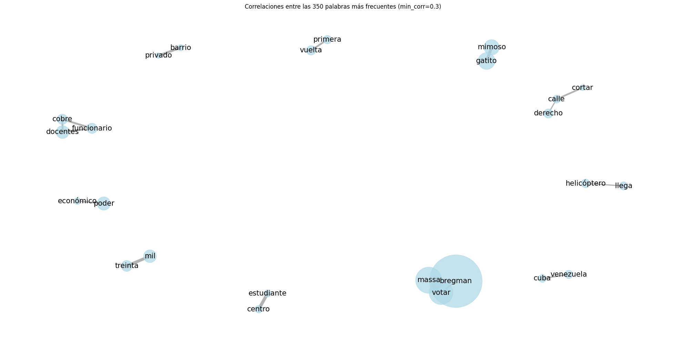

# 🔍 Análisis Exploratorio

El _**análisis de datos exploratorio**_ de los comentarios resulta una etapa fundamental en esta investigación, por un lado, proporciona una comprensión inicial de las palabras utilizadas referidas a cada candidato y por otro lado ha sido utilizado para mejorar y ajustar el paso anterior de limpieza de datos.

## <mark style="background-color:green;">Librerías utilizadas</mark>

```python
import openpyxl # Versión: 3.1.2
import pandas as pd # Versión: 2.2.1
from nltk.corpus import stopwords  # Versión: 3.8.1
import plotly.express as px  # Versión: 5.18.0
from collections import Counter # Versión:  3.11.5
from nltk import FreqDist  # Versión: 3.8.1
from wordcloud import WordCloud # Versión: 1.9.2
import matplotlib.pyplot as plt #Versión: 3.7.3
import re  # Versión: 2.2.1
import matplotlib.colors as mcolors # Versión:3.7.3 
import networkx as nx # Versión 3.1
import nltk # Versión 3.8.1
from sklearn.feature_extraction.text import CountVectorizer # Versión 1.3.0
from scipy.sparse import csr_matrix # Versión 1.11.2
import numpy as np # Versión 1.25.2
```

### <mark style="background-color:green;">Carga de datos</mark>

Utilizaremos los datos obtenidos del apartado anterior de limpieza de datos



```python
# Bregman
file_path1 = 'filtrado_bregman.xlsx'
df1 = pd.read_excel(file_path1)
# Bullrich
file_path2 = 'filtrado_bullrich.xlsx'
df2 = pd.read_excel(file_path2)
# Massa
file_path3 = 'filtrado_massa.xlsx'
df3= pd.read_excel(file_path3)
# Milei
file_path4 = 'filtrado_milei.xlsx'
df4 = pd.read_excel(file_path4)
# Schiaretti
file_path5 = 'filtrado_schiaretti.xlsx'
df5 = pd.read_excel(file_path5)
```


Al tratarse del mismo código para cada candidato, se utilizará como ejemplo el primer data frame df1, que corresponde a la candidata Myriam Bregman. Para realizar las visualizaciones de los restantes candidatos deberá reemplazarse df1 por el correspondiente data frame.


## <mark style="background-color:green;">Depuración y reemplazos para visualizaciones</mark>

Para mejorar la visualización de los comentarios extraídos de las redes sociales, se llevó a cabo una serie de depuraciones de texto que permitieron obtener una representación más clara y comprensible del contenido. Estos ajustes se enfocaron en limpiar y estructurar los datos, facilitando así el análisis visual. Es importante destacar que estos cambios no afectan el proceso de entrenamiento del modelo, ya que están destinados únicamente a optimizar la presentación de la información.

### <mark style="color:green;">Reemplazo de palabras</mark>

Para facilitar la visualización de datos, especialmente en el análisis de frecuencia de palabras, se decidió implementar un proceso de reemplazo de ciertas palabras. Este enfoque busca unificar términos que representan conceptos similares, permitiendo una representación más concisa de los datos.

Se crea la función reemplazar\_palabras()

```python
def reemplazar_palabras(texto):
    """
    Reemplaza palabras específicas en un texto por términos unificados para facilitar
    la visualización de datos.
    Parámetros:
    -texto : str (El texto en el que se realizarán los reemplazos)

    Retorna:
    -str (El texto modificado con las palabras reemplazadas)
    
    """
    
    if pd.isna(texto) or not isinstance(texto, str):
        return texto

    # Diccionario de reemplazos
    reemplazos = {
        ('patricia', 'pato', 'patri', 'patito', 'pb', 'PB'): 'bullrich',
        ('javier', 'miloski', 'javo','mileli','peluca'): 'milei',
        ('masita', 'masa', 'sergio','masa'): 'massa',
        ('perdiste', 'perdio', 'perdieron', 'perdió'): 'perder',
        ('mauricio', 'macrismo', 'macrista'): 'macri',
        ('myriam','miria', 'rusa','troska', 'miram','miryam','mirian','mb'): 'bregman',
        ('kirchneristas', 'kirchner', 'kirchnerista'): 'kirchnerismo',
        ('zurda', 'zurdos', 'zurdo'): 'izquierda',
        ('dijo',): 'decir',
        ('hablo', 'habla', 'hablaron', 'hablan'): 'hablar',
        ('bueno aire', 'bs as','amba'):'buenos aires',
        ('30000','30mil', '30 mil','30 000','30.000'): 'treinta mil',
        ('90',): 'noventa',
        ('dejar','dejo','deja'):'dejaron',
        ('eeuu'): 'estados unidos',
        ('peronismo', 'peronistas', 'peronchos'): 'peron',
        ('enserio',): 'en serio',
    }

    for variantes, reemplazo in reemplazos.items():
        patron = r'\b(' + '|'.join(re.escape(v) for v in variantes) + r')\b'
        texto = re.sub(patron, reemplazo, texto, flags=re.IGNORECASE)

    return texto

```

```python
Aplicamos la función reemplazar_palabras para los dataframes de cada candidato
```

<pre class="language-python"><code class="lang-python"><strong>df1['Texto_corregido'] = df1['Texto_corregido'].apply(reemplazar_palabras)
</strong>df2['Texto_corregido'] = df2['Texto_corregido'].apply(reemplazar_palabras)
df3['Texto_corregido'] = df3['Texto_corregido'].apply(reemplazar_palabras)
df4['Texto_corregido'] = df4['Texto_corregido'].apply(reemplazar_palabras)
df5['Texto_corregido'] = df5['Texto_corregido'].apply(reemplazar_palabras)
</code></pre>

### <mark style="color:green;">Quitar stopwords</mark>

La eliminación de **stopwords** es una práctica común en el procesamiento de lenguaje natural (NLP) y análisis de texto. Estas palabras, que incluyen artículos, preposiciones y pronombres, generalmente no aportan significado relevante al contenido y pueden generar ruido en el análisis. Al eliminarlas, se logra un texto más limpio y enfocado en las palabras que realmente importan para el análisis.

```
#carga de stopwords en español
stop = set(nltk.corpus.stopwords.words('spanish')) 
#actualización
stop.update(['.','q','pq','si','mas','xq','x',"vos",'?','cada','vez', '!','ja','jajaja',"jeje","debate","jaja","jajaj","jajajaja","jejeje","jajjajajajaja",'haber','decir','iba',':', ';', '(', ')', '[', ']', '{', '},']) 
```

```python
#Removemos las stopwords de la columna "Texto_corregido"
df1['Texto_corregido']=df1['Texto_corregido'].apply(lambda x: ' '.join([word for word in x.split() if word not in (stop)]))
df2['Texto_corregido']=df2['Texto_corregido'].apply(lambda x: ' '.join([word for word in x.split() if word not in (stop)]))
df3['Texto_corregido']=df3['Texto_corregido'].apply(lambda x: ' '.join([word for word in x.split() if word not in (stop)]))
df4['Texto_corregido']=df4['Texto_corregido'].apply(lambda x: ' '.join([word for word in x.split() if word not in (stop)]))
df5['Texto_corregido']=df5['Texto_corregido'].apply(lambda x: ' '.join([word for word in x.split() if word not in (stop)]))

```

## <mark style="background-color:green;">Visualizaciones</mark>

### <mark style="color:green;">Número de comentarios por red social</mark>

Para observar con cuántos comentarios se cuenta para cada candidato en las distintas redes sociales, construímos gráficos de columnas. Para cada candidato se debe ejecutar el siguiente código:

```python
# Agrupar los datos por 'Fuente' y contar el número de ocurrencias
df_graf1 = df1.groupby('Fuente').count()['Texto_corregido'].reset_index()

# Crear la gráfica de barras
figura = px.bar(df_graf1, x='Fuente', y='Texto_corregido', title="Frecuencia de comentarios por red social sobre Myriam Bregman",
                labels={'Fuente': 'Red Social', 'Texto_corregido': 'Cantidad de comentarios'})

# Cambiar el color de fondo del gráfico a blanco
figura.update_layout(plot_bgcolor='white')

# Ajustar la altura del gráfico
figura.update_layout(height=400)  # Puedes ajustar el valor de altura según tus necesidades

# Ajustar el rango y las etiquetas del eje Y
figura.update_yaxes(range=[0, 1500], title_text='Cantidad de comentarios')

# Mostrar el gráfica
figura.show()
```

<figure><figcaption><p>Ejemplo cantidad de comentarios por red social para la candidata Myriam Bregman</p></figcaption></figure>

### <mark style="color:blue;">Nube de palabras</mark>

Las nubes de palabras son una representación visual que muestra los términos más frecuentes en un conjunto de datos. Dichas palabras se presentan en tamaño proporcional a su frecuencia de aparición, es decir, las palabras más mencionadas serán aquellas de mayor dimensión.&#x20;

Las nubes de palabras permiten captar de forma rápida los términos más utilizados y relacionados cada candidato.

```python
# BREGMAN

# Unir todos los textos de los comentarios en una sola cadena
texto_completo1= ' '.join(df1['Texto_corregido'])

# Contar la frecuencia de cada palabra en el texto completo
counter = Counter(texto_completo1.split())

# Obtener las 50 palabras más comunes y almacenarlas en un diccionario
palabras_comunes = dict(counter.most_common(50))

# Crear la nube de palabras a partir de las frecuencias de las palabras
#Formato vertical
#wordcloud = WordCloud(width=200, height=400, background_color='white').generate_from_frequencies(palabras_comunes)
#formato horizontal
wordcloud = WordCloud(width=600, height=400, background_color='white').generate_from_frequencies(palabras_comunes)

# Mostrar la nube de palabras utilizando matplotlib
plt.figure(figsize=(10, 5))
plt.imshow(wordcloud, interpolation='bilinear')
plt.axis('off')
plt.title('Nube de Palabras: 50 palabras más utilizadas en comentarios sobre Myriam Bregman')
plt.show()
```

<figure><figcaption><p>Ejemplo nube de palabras de las 50 palabras más utilizadas en comentarios sobre la candidata Myriam Bregman</p></figcaption></figure>

### <mark style="color:blue;">Grafos de co-ocurrencia</mark>

Los **grafos de co-ocurrencia** permiten visualizar las relaciones entre palabras basándose en la frecuencia con las que aparecen juntas dentro de un corpus definido, en este caso, los comentarios sobre cada candidato en las distintas plataformas de redes sociales- La construcción de estos grafos implica la identificación de pares de palabras que co-ocurren dentro de una ventana definida (un comentario), luego se calcula la frecuencia de co-ocurrencia de cada par de palabras en el total de comentarios disponibles. La visualización de estas relaciones forma un grafo, donde las palabras son los nodos y las conexiones entre ellas, arcos, representan su co-ocurrencia mediante el grosor de las líneas indicando la fuerza de asociación.

Se define la función crear\_grafo()

```python
def crear_grafo(df, columna='Texto_corregido', num_palabras=100, correlacion_min=0.2):
    """
    Crea un grafo de co-ocurrencia de palabras a partir de un DataFrame.

    Esta función toma una columna de un DataFrame que contiene texto, tokeniza las palabras,
    calcula la correlación entre las palabras más frecuentes y visualiza el grafo resultante.

    Parámetros:
    - df : pandas.DataFrame (DataFrame que contiene la columna de texto)
    - columna : str (nombre de la columna en el DataFrame que contiene el texto (por defecto 'Texto_corregido'))
    - num_palabras : int (número de palabras más frecuentes a considerar para el grafo (por defecto 100))
    - correlacion_min : float (Umbral mínimo de correlación para incluir pares de palabras en el grafo (por defecto 0.2))

    Retorna:
    - G : networkx.Graph (El grafo de co-ocurrencia generado)
    - pares_corr : pandas.DataFrame (DataFrame con los pares de palabras y sus correlaciones)
    - dict(palabras_frecuentes) : dict (diccionario con las palabras más frecuentes y sus frecuencias)
    """
    
    # Asignar un ID único a cada fila del DataFrame
    df['id'] = range(len(df))
    
    # Tokenizar el texto y contar la frecuencia de palabras
    vectorizer = CountVectorizer(token_pattern=r'\b\w+\b')  # Definir el patrón para tokenizar palabras (palabras completas)
    X = vectorizer.fit_transform(df[columna])  # Crear una matriz de términos
    palabras = vectorizer.get_feature_names_out()  # Obtener los nombres de las palabras
    
    # Seleccionar las palabras más frecuentes
    frecuencias = X.sum(axis=0).A1  # Sumar las frecuencias por palabra
    palabras_frecuentes = sorted(zip(palabras, frecuencias), key=lambda x: x[1], reverse=True)[:num_palabras]
    
    # Extraer solo las palabras seleccionadas
    palabras_seleccionadas = [palabra for palabra, _ in palabras_frecuentes]
    
    # Filtrar la matriz para incluir solo las palabras seleccionadas
    indices_seleccionados = [vectorizer.vocabulary_[palabra] for palabra in palabras_seleccionadas]
    X_filtrada = X[:, indices_seleccionados]  # Crear una nueva matriz filtrada
    
    # Calcular correlaciones entre las palabras seleccionadas
    X_bool = X_filtrada.astype(bool).astype(int)  # Convertir a matriz booleana para calcular correlaciones
    correlaciones = (X_bool.T @ X_bool) / np.sqrt(np.outer(X_bool.sum(axis=0), X_bool.sum(axis=0)))  # Calcular correlaciones
    correlaciones = correlaciones.toarray()  # Convertir a array
    
    # Crear un DataFrame de correlaciones
    df_corr = pd.DataFrame(correlaciones, index=palabras_seleccionadas, columns=palabras_seleccionadas)
    
    # Filtrar pares de correlaciones significativas
    pares_corr = df_corr.unstack().reset_index()  # Transformar el DataFrame para obtener pares
    pares_corr.columns = ['item1', 'item2', 'correlation']  # Renombrar columnas
    pares_corr = pares_corr[pares_corr['item1'] < pares_corr['item2']]  # Mantener solo combinaciones únicas
    pares_corr = pares_corr[pares_corr['correlation'] > correlacion_min]  # Filtrar por correlación mínima
    
    # Crear grafo a partir del DataFrame de pares de correlación
    G = nx.from_pandas_edgelist(pares_corr, 'item1', 'item2', ['correlation'])
    
    # Visualizar el grafo resultante
    plt.figure(figsize=(20, 10))  # Ajustar el tamaño del gráfico según sea necesario
    pos = nx.spring_layout(G, k=0.5, iterations=100)  # Posicionar los nodos usando el algoritmo Fruchterman-Reingold
    # el parámetro k da la separación entre nodos
    
    # Calcular tamaños de nodos basados en la frecuencia
    node_sizes = [dict(palabras_frecuentes).get(node, 1) * 15 for node in G.nodes()]
    
    # Dibujar nodos del grafo
    nx.draw_networkx_nodes(G, pos, node_size=node_sizes, node_color='lightblue', alpha=0.7)
    
    # Dibujar aristas del grafo con pesos basados en la correlación
    edge_weights = [G[u][v]['correlation'] * 7 for u, v in G.edges()]
    nx.draw_networkx_edges(G, pos, width=edge_weights, alpha=0.6, edge_color='gray')
    
    # Añadir etiquetas a los nodos del grafo
    nx.draw_networkx_labels(G, pos, font_size=15, font_family='sans-serif')  # Reducir tamaño de fuente
    
    plt.title(f"Correlaciones entre las {num_palabras} palabras más frecuentes (min_corr={correlacion_min})")
    plt.axis('off')  # Desactivar los ejes del gráfico
    plt.tight_layout()  # Ajustar el diseño del gráfico para evitar superposiciones
    plt.show()  # Mostrar el gráfico
    
    return G, pares_corr, dict(palabras_frecuentes)  # Retornar el grafo, DataFrame de pares y diccionario de frecuencias

```

```
# Bregman :  350 palabras más frecuentes y min-correlación 0.3
G, pares_corr, frecuencias = crear_grafo(df1, columna='Texto_corregido', num_palabras=350, correlacion_min=0.30)
```

<figure><figcaption><p>Ejemplo 5 bigramas más frecuentes en comentarios de la candidata Myriam Bregman</p></figcaption></figure>
