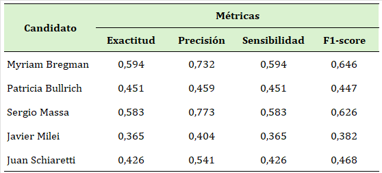

# 🧪 Evaluación del modelo base

Antes de proceder con el ajuste fino del modelo base, es fundamental evaluar su desempeño en un subconjunto de datos etiquetados del conjunto original. Esta evaluación inicial nos permitirá analizar cómo se comporta el modelo base en condiciones reales y obtener una referencia sobre su capacidad para clasificar correctamente los datos.

Para realizar esta evaluación dividimos el conjunto de datos en dos partes: entrenamiento y testeo. Utilizamos el 80% de los datos para entrenar el modelo y el 20% restante para probar su desempeño, asegurando así que el modelo se evalúe con datos que no ha visto previamente. Esta división ayuda a obtener una primera impresión del desempeño del modelo base y la generalización del modelo en datos nuevos, proporcionando una línea base para compararla con la versión ajustada o fine-tuneada del modelo.

## <mark style="background-color:green;">Modelo base</mark>

El modelo [**cardiffnlp/twitter-xlm-roberta-base-sentiment**](https://huggingface.co/cardiffnlp/twitter-xlm-roberta-base-sentiment) es un modelo multilingüe entrenado sobre una base de 198 millones de tweets y optimizado para el análisis de sentimientos en ocho idiomas diferentes. El modelo ofrece una salida probabilística, categorizando los comentarios en tres niveles de sentimiento: negativo (etiqueta 0), neutro (etiqueta 1) y positivo (etiqueta 2).\


## <mark style="background-color:green;">Librerías</mark>

```python
import pandas as pd
import torch
from transformers import AutoTokenizer, AutoModelForSequenceClassification
from sklearn.model_selection import train_test_split
from sklearn.preprocessing import LabelBinarizer
from sklearn.metrics import (accuracy_score, precision_recall_fscore_support, 
confusion_matrix)

```

## <mark style="background-color:green;">Carga de datos</mark>

En la carpeta datos\_etiquetados.zip se encuentran los comentarios etiquetados manualmente. En cada caso, se etiquetó el 15% del corpus total de cada candidato.




En esta etapa el código es el mismo para cada candidato, como ejemplo tomaremos el código para el caso de la candidata Patricia Bullrich.&#x20;


```python
df = pd.read_excel('bullrich_etiquetas.xlsx')
df_filtrado = df[df['tag'].notna()]
```

## <mark style="background-color:green;">Dividir los datos en entrenamiento y testeo</mark>

Dividimos el dataset: el 80% de los datos sirve para entrenar el modelo (que veremos en la sección de ajuste fino) y el 20% restante para probar su desempeño, asegurando así que el modelo se evalúe con datos que no ha visto previamente.

```python
X = df_filtrado[['Texto_corregido']]
y = df_filtrado['tag'].dropna()
X_train, X_test, y_train, y_test = train_test_split(X, y, test_size=0.2,
 random_state=94)

```


La semilla se ha fijado en 94 durante la división en entrenamiento y prueba para garantizar la reproducibilidad de los resultados. Esto permitirá comparar de manera consistente el desempeño del modelo base con el modelo fine-tuneado, ya que ambos serán evaluados sobre el mismo conjunto de datos de testeo. De este modo, cualquier mejora en las métricas de desempeño se podrá atribuir al proceso de fine-tuning en lugar de a variaciones en la división de los datos.


```python
# DataFrames de entrenamiento y prueba completos
train_df = pd.concat([X_train, y_train], axis=1)
test_df = pd.concat([X_test, y_test], axis=1)
```

## <mark style="background-color:green;">Cargar el modelo base y su tokenizador</mark>

Se carga el modelo de análisis de sentimientos directamente desde Hugging Face (mediante la librería _<mark style="color:green;">transformers</mark>_). El `tokenizer`permite convertir el texto en tokens para que el modelo pueda procesarlo, mientras que `AutoModelForSequenceClassification` carga la arquitectura de clasificación necesaria para realizar el análisis de sentimientos.

```python
model_path = "cardiffnlp/twitter-xlm-roberta-base-sentiment"
tokenizer = AutoTokenizer.from_pretrained(model_path)
model = AutoModelForSequenceClassification.from_pretrained(model_path)
```

A continuación se realiza el análisis de sentimientos en el conjunto de prueba. Primero, se crea una lista `sentimientos` para almacenar las predicciones. Luego, se itera sobre cada comentario en `test_df`, convirtiéndolo en tókenes que el modelo procesa para obtener los `logits`. A partir de estos, se determina la clase de sentimiento predicha, que se agrega a la lista `sentimientos`. Al finalizar, las predicciones se incorporan a `test_df` en una nueva columna llamada `sentimiento`, lista para su análisis comparativo.

```python
# Lista para almacenar las predicciones
sentimientos = []

# Realizar el análisis de sentimientos en el conjunto de prueba
for _, row in test_df.iterrows():
    text = str(row['Texto_corregido'])  # Asegurar que es una cadena
    
    # Tokenización y predicción
    inputs = tokenizer(text, return_tensors="pt", padding=True, 
    truncation=True, max_length=700)
    outputs = model(**inputs)
    logits = outputs.logits
    predicted_class = torch.argmax(logits, dim=1)
    sentimientos.append(predicted_class.item())

# Agregar las predicciones al DataFrame de prueba
test_df['sentimiento'] = sentimientos
```

## <mark style="background-color:green;">Evaluar predicciones modelo base</mark>

Se define la función `evaluate_model` para calcular métricas de evaluación para el modelo de clasificación, incluyendo exactitud, precisión, sensibilidad y puntaje F1, tanto ponderados como específicos por clase. También genera la matriz de confusión y calcula especificidad, valor predictivo positivo (PPV) y negativo (NPV) para cada clase.

```python
def evaluate_model(y_true, y_pred):
    """
    Calcula varias métricas de evaluación para un modelo de clasificación.

    Parámetros:
    y_true : array-like
        Etiquetas verdaderas (reales) del conjunto de datos.
    y_pred : array-like
        Etiquetas predichas por el modelo.

    Retorna:
    dict : Un diccionario que contiene las métricas calculadas:
        - 'accuracy': Exactitud general del modelo.
        - 'precision_weighted': Precisión ponderada por clase.
        - 'recall_weighted': Sensibilidad ponderada por clase.
        - 'f1_score_weighted': Puntaje F1 ponderado por clase.
        - 'precision_per_class': Precisión por clase (array).
        - 'recall_per_class': Sensibilidad por clase (array).
        - 'f1_per_class': Puntaje F1 por clase (array).
        - 'confusion_matrix': Matriz de confusión (2D array).
        - 'specificity_per_class': Especificidad por clase (array).
        - 'ppv_per_class': Valor predictivo positivo (PPV) por clase (array).
        - 'npv_per_class': Valor predictivo negativo (NPV) por clase (array).
    """

    # Calcular exactitud
    accuracy = accuracy_score(y_true, y_pred)
    
    # Calcular precisión, sensibilidad y puntaje F1 ponderado para todas las clases
    precision, recall, f1, _ = precision_recall_fscore_support(y_true, y_pred, average='weighted')
    
    # Calcular precisión, sensibilidad y puntaje F1 específico para cada clase
    per_class_metrics = precision_recall_fscore_support(y_true, y_pred, average=None)
    precision_per_class, recall_per_class, f1_per_class = per_class_metrics[:3]
    
    # Generar la matriz de confusión
    cm = confusion_matrix(y_true, y_pred)
    
    # Preparar los datos para el cálculo de AUC multiclase (si se desea implementar AUC)
    lb = LabelBinarizer()
    y_true_bin = lb.fit_transform(y_true)
    y_pred_bin = lb.transform(y_pred)
    
    # Calcular especificidad (negativos verdaderos / (negativos verdaderos + falsos positivos)) para cada clase
    specificity_per_class = []
    for i in range(len(cm)):
        tn = cm.sum() - (cm[i, :].sum() + cm[:, i].sum() - cm[i, i])  # Negativos verdaderos
        fp = cm[:, i].sum() - cm[i, i]  # Falsos positivos
        specificity = tn / (tn + fp) if (tn + fp) != 0 else 0
        specificity_per_class.append(specificity)
    
    # El valor predictivo positivo (PPV) para cada clase es igual a la precisión de cada clase
    ppv_per_class = precision_per_class
    
    # Calcular el valor predictivo negativo (NPV) para cada clase
    npv_per_class = []
    for i in range(len(cm)):
        tn = cm.sum() - (cm[i, :].sum() + cm[:, i].sum() - cm[i, i])  # Negativos verdaderos
        fn = cm[i, :].sum() - cm[i, i]  # Falsos negativos
        npv = tn / (tn + fn) if (tn + fn) != 0 else 0
        npv_per_class.append(npv)

    return {
        'accuracy': accuracy,  # Exactitud global del modelo
        'precision_weighted': precision,  # Precisión ponderada (considera la proporción de cada clase)
        'recall_weighted': recall,  # Sensibilidad ponderada (considera la proporción de cada clase)
        'f1_score_weighted': f1,  # Puntaje F1 ponderado (balancea precisión y sensibilidad)
        'precision_per_class': precision_per_class,  # Precisión para cada clase
        'recall_per_class': recall_per_class,  # Sensibilidad para cada clase
        'f1_per_class': f1_per_class,  # Puntaje F1 para cada clase
        'confusion_matrix': cm,  # Matriz de confusión para visualizar los aciertos y errores por clase
        'specificity_per_class': specificity_per_class,  # Especificidad para cada clase (falsos positivos controlados)
        'ppv_per_class': ppv_per_class,  # Valor predictivo positivo para cada clase (igual a precisión por clase)
        'npv_per_class': npv_per_class  # Valor predictivo negativo para cada clase (probabilidad de no tener la clase cuando no se predice)
    }
```

Utilizamos las etiquetas reales (`y_true`) y las predicciones del modelo (`y_pred`) del conjunto de prueba (`test_df`) para evaluar el desempeño del modelo. La función `evaluate_model` se llama con estas dos series de datos, y el resultado, almacenado en `metrics`, contiene el conjunto completo de métricas de evaluación.

```python
y_true = test_df['tag']
y_pred = test_df['sentimiento']
metrics = evaluate_model(y_true, y_pred)
```

```python
# Imprimir resultados
for metric, value in metrics.items():
    if metric != 'confusion_matrix':
        print(f"{metric}: {value}")
    else:
        print(f"{metric}:\n{value}")
```

## Métricas de desempeño modelo base

A continuación se presentan las métricas de desempeño del modelo base para cada candidato.

<figure><figcaption></figcaption></figure>
