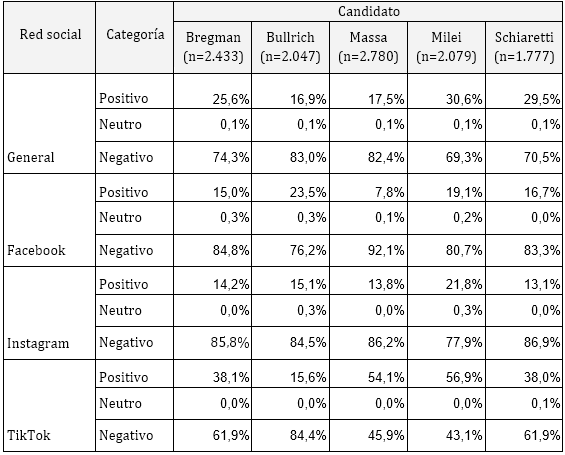
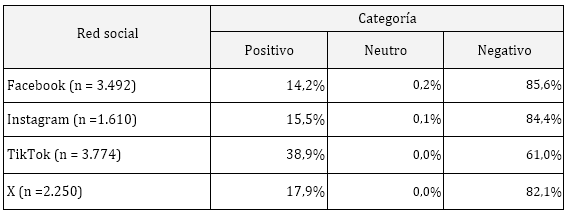

# ✅ Resultados

Se clasifican todos los comentarios de cada candidato utilizando los nuevos modelos ajustados.

Sin desagregar por plataforma, el candidato Javier Milei se posicionó como el candidato con mayor proporción de comentarios positivos (30,6%), seguido por Juan Schiaretti (29,5%) y Myriam Bremgan (25,6%). En contraste, los candidatos Patricia Bullrich y Sergio Massa registraron la proporción más baja de comentarios positivos, con apenas un 17%. Ninguno de los candidatos alcanzó una mayoría de comentarios positivos, evidenciando una clara tendencia negativa en el discurso en redes sociales. No obstante, la incidencia de comentarios negativos varía tanto entre candidatos como entre plataformas.

<figure><figcaption></figcaption></figure>

<figure><figcaption></figcaption></figure>

En el caso de la candidata Myriam Bregman, en todas las redes sociales fueron predominantes los comentarios negativos, aunque TikTok mostró una proporción de comentarios positivos ligeramente mayor que las demás plataformas.

El perfil de comentarios para la candidata Patricia Bullrich también es consistentemente negativo en todas las redes. La mayor negatividad se presenta en X, mientras que Facebook tiene la menor proporción de comentarios negativos entre todas las redes sociales.

Los comentarios sobre el candidato Sergio Massa son en su mayoría negativos en casi todas las redes sociales, exceptuando la plataforma TikTok, donde presenta una mayor proporción de comentarios positivos.

La negatividad de los comentarios sobre el candidato Javier Milei se observa fuertemente en la plataforma X, seguido por Facebook e Instagram que presentan proporciones similares de comentarios positivos y negativos. Al igual que el candidato Sergio Massa, presenta una mayor proporción de comentarios positivos en TikTok.

Finalmente, los comentarios del candidato Juan Schiaretti son predominantemente negativos, aunque se destaca también TikTok como la red con mayor proporción de comentarios positivos.

Analizar los sentimientos generales por red social permite identificar las diferencias en la percepción generalizada de las publicaciones en cada plataforma, sin desagregar por candidato. Se analizan los porcentajes de comentarios positivos, neutros y negativos para cada red social, junto con el total analizado. Se destaca el nivel de "negatividad" predominante en cada red, lo que puede proporcionar una caracterización del tono general y las dinámicas discursivas en cada plataforma.

<figure><figcaption></figcaption></figure>

El análisis de los comentarios por red social muestra una clara predominancia de interacciones negativas en la mayoría de las plataformas. En X, Instagram y Facebook, los comentarios negativos superan el 80% del total, destacando un tono crítico entre los usuarios de estas redes. Por otro lado, TikTok presenta un panorama distinto, siendo la red social con el menor porcentaje de comentarios negativos (61%).

\
